# **Happening API**

## Table of Contents

- [Project](#project)
  * [Objective](#objective)
  * [Links to Deployed Project](#links-to-deployed-project)
- [Project Structure](#project-structure)
  * [Developer User Stories](#developer-user-stories)
    + [Profiles](#profiles)
    + [Events](#events)
    + [Comments](#comments)
    + [Interested](#interested)
    + [Going](#going)
    + [Followers](#followers)
    + [Search and Filter](#search-and-filter)
    + [Reviews](#reviews)
    + [Contact](#contact)
- [Database Design](#database-design)
  * [Models](#models)
- [Features](#features)
  * [Homepage](#homepage)
  * [Profile Data](#profile-list)
  * [Events Data](#events-list)
  * [Comments Data](#comments-data)
  * [Interested Data](#interested-data)
  * [Going Data](#going-data)
  * [Followers Data](#followers-data)
  * [Reviews Data](#reviews-data)
  * [Contact Data](#contact-data)
- [Agile Workflow](#agile-workflow)
  * [Github Project Board](#github-project-board)
- [Testing](#testing)
- [Deployment](#deployment)
- [Credits](#credits)

# **Project**

## Objective

I live in a small town of around 15,000 people in the south of Spain, where lots of great events happen, but unlike in the big cities, there are no websites or applications dedicated to publicising the event information out to the people. 

Happening API provides a backend database to create, view, edit and delete event information for my town. A user who wishes to share an event can upload information about the event, including the date, a description, a category for who it's ideally aimed at, an image or event poster, and keyword tags. A user who wishes to attend events can follow event hosts, show their interest in an event, mark as attending an event, comment on an event and write a review or leave a rating for an event.

The API also includes search and filter logic to improve user experience, and make it easier for users to find events tailored to their own interests. 

## Links to Deployed Project

  + The project is deployed on Heroku and is available at the folowing link: [Deployed Happening API](https://happening-api-kelz.herokuapp.com/)
  + The link for the GitHub repo to corresponding front end for this project is here: [Happening Front End](https://github.com/)

## Project Structure

The overall structure of the project was modelled on the [drf-api](https://github.com/Code-Institute-Solutions/drf-api) walkthrough due to time constraints and the Project 5 assessments requirements including most of what is included in the walkthrough project.

However, additional custom models have also been developed where possible such as going, and review, and I have tried to customize the walkthrough models somewhat as well to fit more closely with the scope of my own sharing platform. 

## Developer User Stories
### Profiles

+ As a developer/superuser I can view a list of all profiles so that I can see all the profiles that have been created
+ As a developer/superuser I can view the details of one profile so that I can see individual profile data
+ As a developer/superuser I can edit a profile when I am logged in so that update my personal information
+ As a developer/superuser I can delete a profile that I own so that I can delete my user account from the API

### Events

+ As a developer/superuser I can view a list of all events so that I can see all events at once
+ As a developer/superuser I can view a single event so that I can see single event details, including comments
+ As a developer/superuser I can create a new event so that this event will be displayed in the events list
+ As a developer/superuser I can edit an event that I created so that I can amend any missing or incorrect information on the event posting
+ As a developer/superuser I can delete an event which I created so that I can delete event data from the API

### Comments

+ As a developer/superuser I can create a comment so that I can link a comment to an event
+ As a developer/superuser I can view a list of all comments so that I can see all comments created in the API
+ As a developer/superuser I can retrieve a single comment by ID so that I can edit or delete this comment
+ As a developer/superuser I can edit a comment that I created so that I can amend any missing or incorrect information
+ As a developer/superuser I can delete a comment which I created so that I can delete comment data from the API

### Interested

+ As a developer/superuser I can create an interested object linked to a single event so that I can show interest in an event
+ As a developer/superuser I can delete an interested object which I created so that I can delete interested data from the API
+ As a developer/superuser I can not delete an interested object which I did not create
+ As a developer/superuser I can view a list of all interested objects so that I can see all interested objects created in the API

### Going

+ As a developer/superuser I can create a going object linked to a single event so that I can show confirmed attendance to an event
+ As a developer/superuser I can delete a going object which I created so that I can delete going data from the API
+ As a developer/superuser I can not delete a going object which I did not create
+ As a developer/superuser I can view a list of all going objects so that I can see all going objects created in the API

### Followers

+ As a developer/superuser I can create a follow so that I can follow another user
+ As a developer/superuser I can view a list of follows so that I can see all the follows that have been created
+ As a developer/superuser I can delete a follow so that I can unfollow another user profile


### Search and Filter

+ As a developer/superuser I can see a search field in the events list so that I can search for a specific event
+ As a developer/superuser I can filter the events list by category so that I can see only the events relating to one desired category
+ As a developer/superuser I can view a list of events by profiles I follow so that I can see only the events relating to profiles that I like
+ As a developer/superuser I can view a list of profiles followed by another profile so that I can see which profiles are following it
+ As a developer/superuser I can view a list of events I have posted an interested or going id to so that I can see only the events I am interested in attending
+ As a developer/superuser I can view a list of events relating to just one profile so that I can see only the events posted by a single user
+ As a developer/superuser I can view a list of comments linked to a particular event so that I can see see the comments relating to one single event id
+ As a developer/superuser I can view a list of reviews linked to a particular event so that I can see see the reviews relating to one single event id


### Reviews

+ As a developer/superuser I can create a review so that I can link a review and rating to an event
+ As a developer/superuser I can view a list of all reviews so that I can see all reviews created in the API
+ As a developer/superuser I can edit a review that I created so that I can amend any missing or incorrect information
+ As a developer/superuser I can delete a review which I created so that I can delete review data from the API

### Contact

+ As a developer/superuser I can create a contact so that I can see messages created
+ As a developer/superuser I can view a list of all contacts so that I can see all contacts created in the API
+ As a developer/superuser I can edit a contact that I created so that I can amend any missing or incorrect information
+ As a developer/superuser I can delete a contact which I created so that I can delete contact data from the API


# Database Designs

## Models

I have created the following models for the Happening Backend API:
 * User (slightly customized from the Django standard User model)
 * Profile (automatically created on User creation)
 * Event (A post publicising a future event)
 * Comment (To make a comment on an event while it's being promoted)
 * Interested (To indicate if a user thinks the event sounds good)
 * Going (To indicate if the user plans to attend the event)
 * Follow (For users to follow event hosts)
 * Review (For users to rate and add a review comment post event)
 * Contact (To send a message to the email address in a profile)

The relationships between all of these models is summarized in the followed entity relationship diagram:
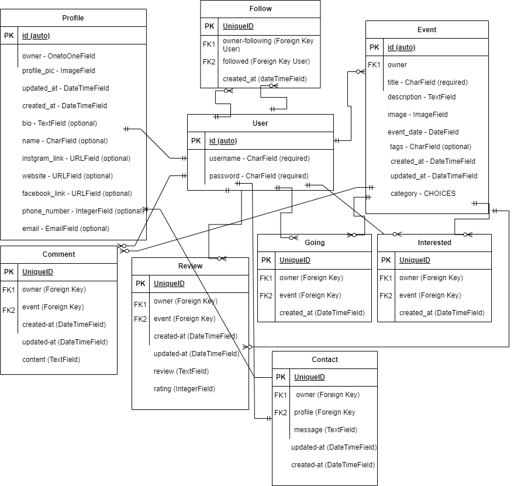

# Features

## Homepage

When you first enter the API site, you are directed to the Root Route hompage, with a message welcoming you to the API for Happening. 

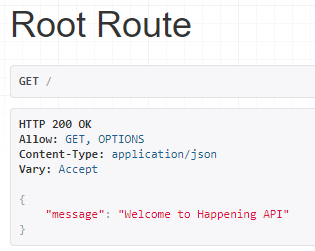

## Profile Data

Within the Profile List section, a user can view a list of all profiles in the API. Create functionality is not enabled, as the process is done automatically through the user registration process. 

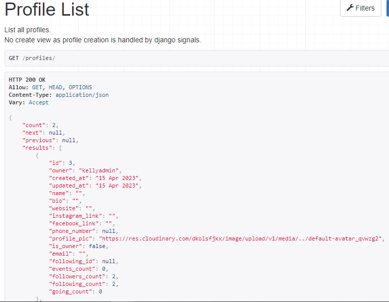

Besides the fields created in the Profile model (as shown in the ERD Diagram), through the serializer, I also added the following fields to the JSON data:

* is_owner
* following_id
* events_count
* followers_count
* following_count
* going_count

I have set up ordering for the profile list, and selected the following parameters to sort the profiles by:

* events_count
* followers_count
* following_count
* going_count
* owner__following_created_at
* owner__followed_created_at

I have set up two field filters on the events list to filter as follows:

1. Profiles that are following the logged in user
2. Profiles that are being followed by the logged in user

If the user logs in, and views the detail of their own profile, additional Update and Delete functionality becomes available. Below the profile data, a pre-populated form is available to edit the profile model fields. At the top of the screen, a delete button is available to delete the profile from the API.

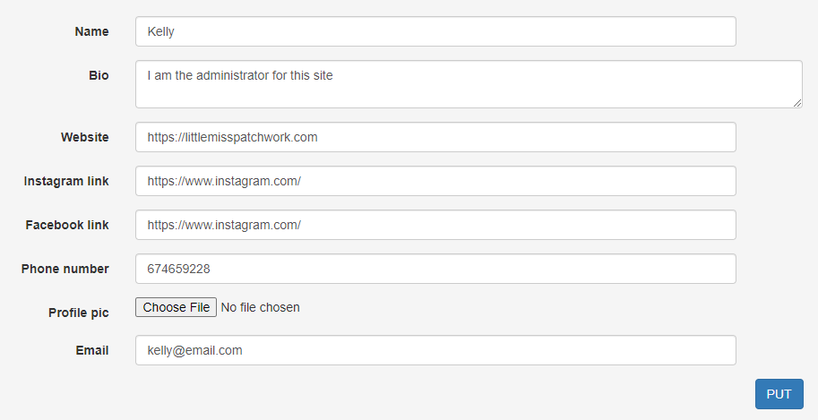

## Events Data

Within the Events List section, a user can view a list of all events in the API. 

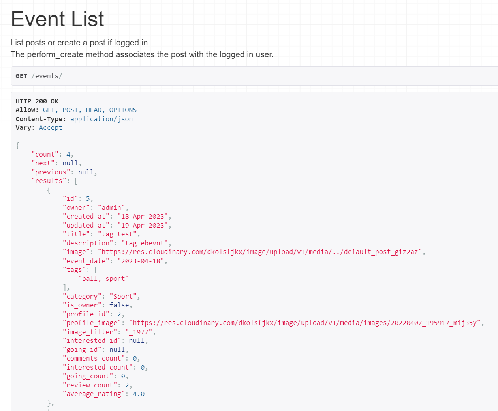

Besides the fields created in the Event model (as shown in the ERD Diagram), through the serializer, I also added the following fields to the JSON data:

* is_owner
* profile_id
* profile_image
* image_filter
* interested_id
* going_id
* review_id
* comments_count
* interested_count
* going_count
* review_count
* average_rating

I have set up ordering for the events list, and selected the following parameters to sort the events by:

* comments_count
* interested_count
* going_count
* review_count
* average_rating
* interested_created_at
* going_created_at
* event_date

I have set up a search function whereby the full events list can be searched on by the event owner, title, event data, or event tags.

I have set up five field filters on the events list to filter as follows:

1. Events whose owners the logged in user is following - This will be the front end 'Feed' page
2. Events which the logged in user has posted interested in - This will combine with filter 3 to be the front end 'My Events' page 

3. Events which the logged in user has posted going to - This will combine with filter 2 to be the front end 'My Events' page

4. All events posted by user - This will be used in the 'Profile' page

5. All events in one category - This filter will be visible on all front end Event List pages

If the user logs in, a form becomes visible under the events list to create a new event. 

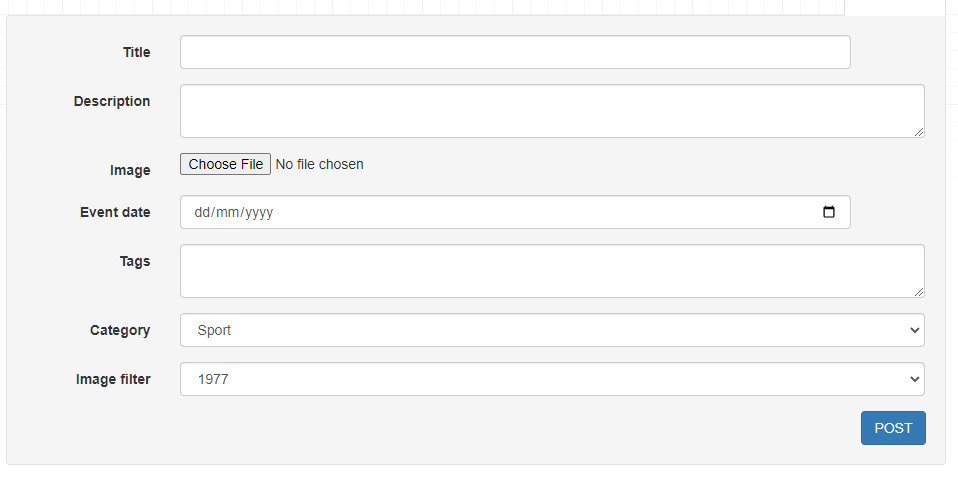

Once logged in, if the user views the details of a single event which they created additional Update and Delete functionality becomes available. Below the event data, a pre-populated form is available to edit the event. At the top of the screen, a delete button is available to delete the event from the API.

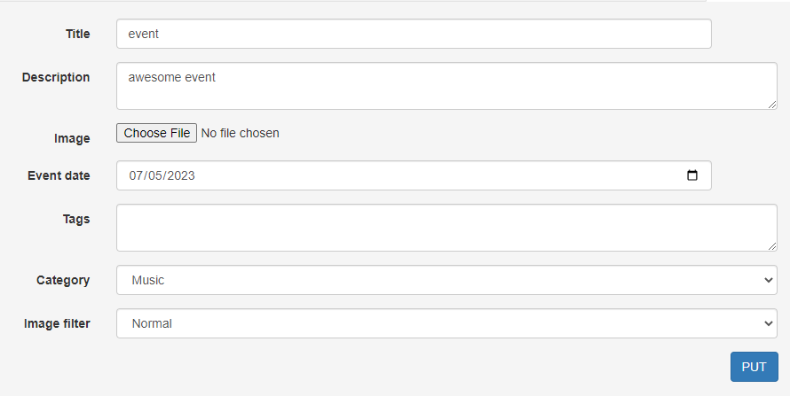

## Comments Data

Within the Comments List section, a user can view a list of all comments in the API. 

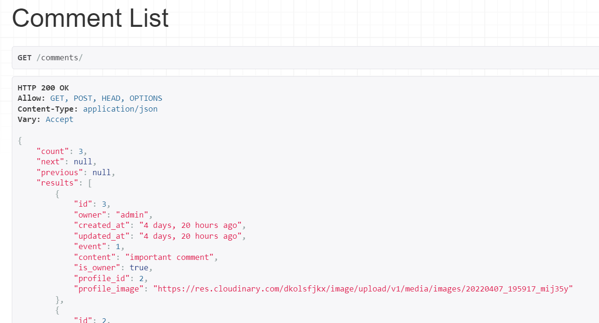

Besides the fields created in the Comment model (as shown in the ERD Diagram), through the serializer, I also added the following fields to the JSON data:

* is_owner
* profile_id
* profile_image

I also set up one field filter to filter the comments by the event they are commenting on.

If the user logs in, a form becomes visible under the comments list to create a new comment. The event they want to comment on can be selected from the dropdown, and a comment text must be entered to post the comment successfully.

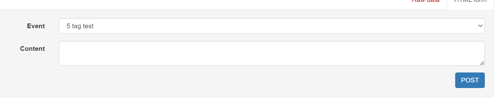

Once logged in, if the user views the details of a single comment which they created additional Update and Delete functionality becomes available. Below the comment data, a pre-populated form is available to edit the comment. At the top of the screen, a delete button is available to delete the comment from the API.

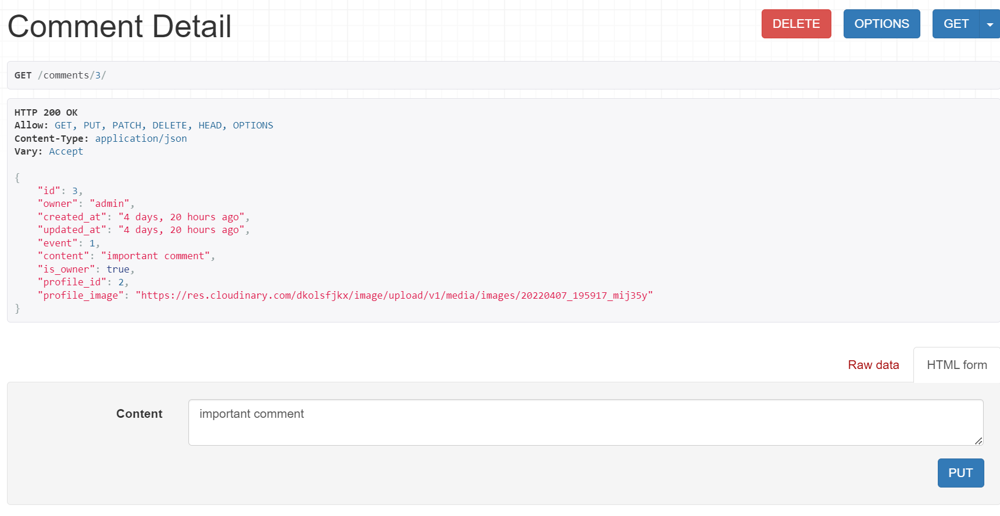

## Interested Data

Within the Interested List section, a user can view a list of all interested posts in the API. 

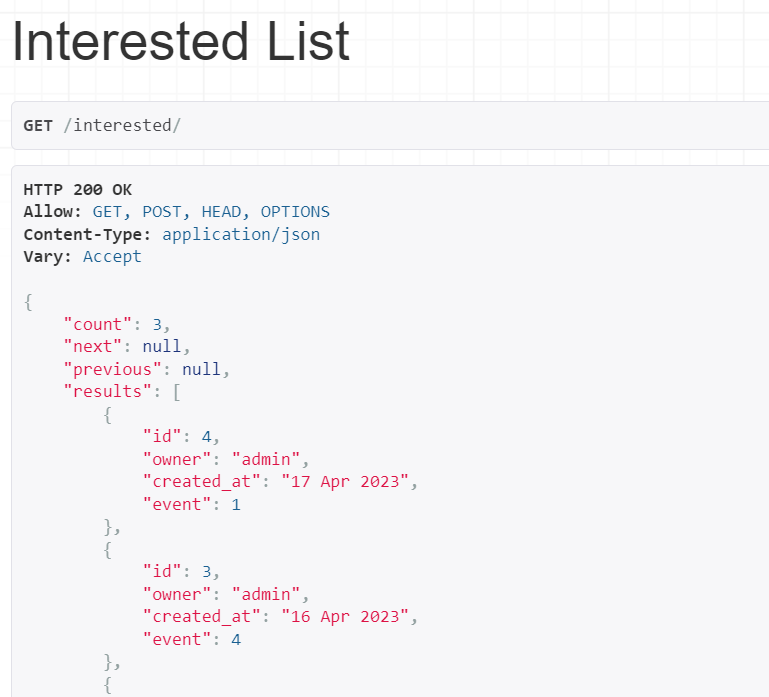

If the user logs in, a form becomes visible under the interested list to create a new interested post. The event they want to be interested in can be selected from the dropdown, to link the interest with the event.

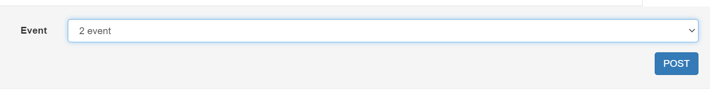

If a user tries to post interest to the same event twice, they see an error message saying that they are already interested in the selected event, and the duplicate interested post is not created.

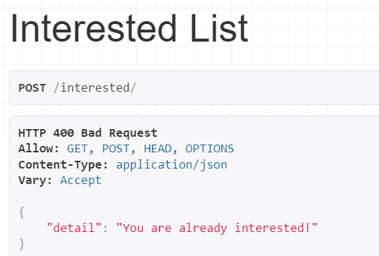

Once logged in, if the user views the details of a single interested post which they created additional Delete functionality becomes available. It is not possible to Edit an interested post.

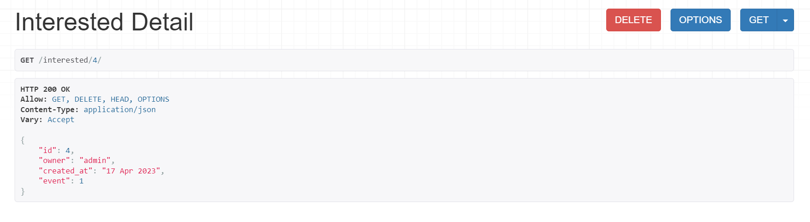

## Going Data

Within the Going List section, a user can view a list of all going posts in the API. 

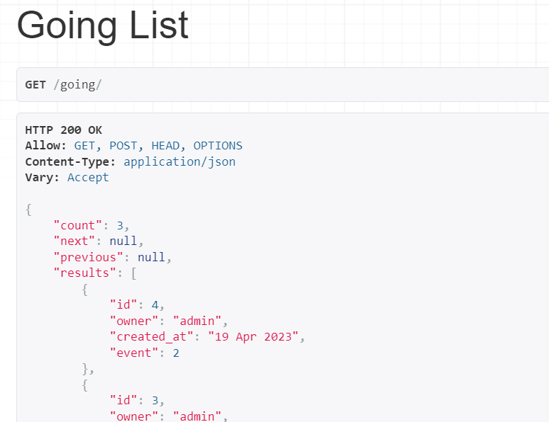

If the user logs in, a form becomes visible under the going list to create a new going post. The event they want to be going to can be selected from the dropdown, to link the going post with the event.

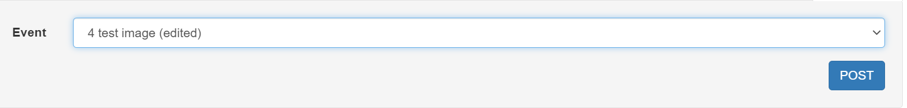

If a user tries to post going to the same event twice, they see an error message saying that they are already going to the selected event, and the duplicate going post is not created.

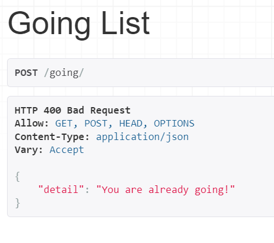

Once logged in, if the user views the details of a single going post which they created additional Delete functionality becomes available. It is not possible to Edit a going post.

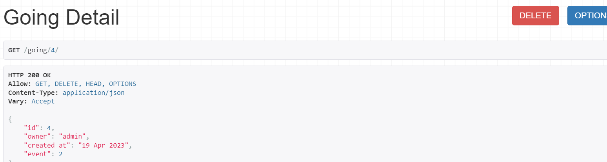

## Followers Data

Within the Follower List section, a user can view a list of all follower posts in the API. 

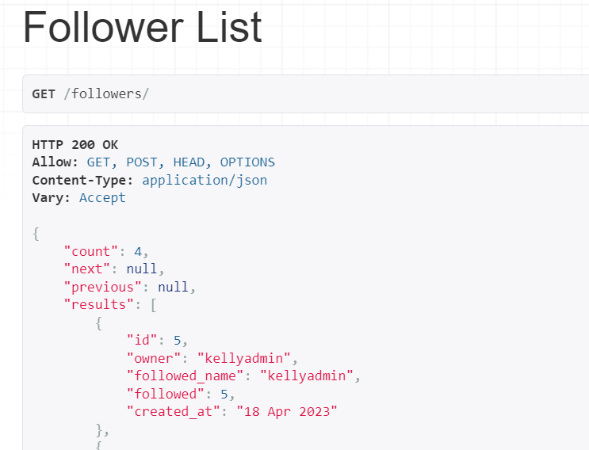

If the user logs in, a form becomes visible under the follower list to create a new follower post. The user they want to follow can be selected from the dropdown, to link the follower post with another user profile.

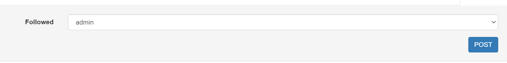

If a user tries to follow the same profile twice, they see an error message saying that they are already following the selected profile, and the duplicate follow post is not created.

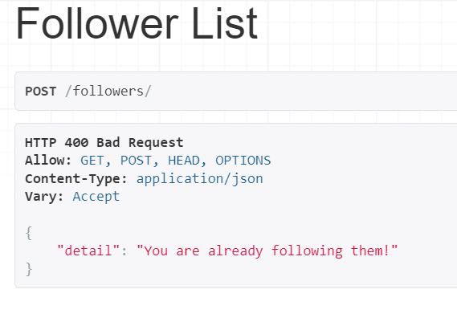

Once logged in, if the user views the details of a single follower post which they created additional Delete functionality becomes available. It is not possible to Edit a follower post.

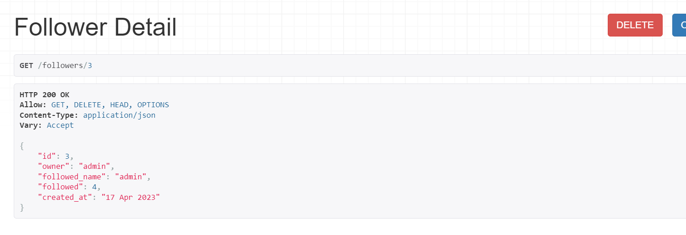

## Reviews Data

Within the Review List section, a user can view a list of all reviews in the API. 

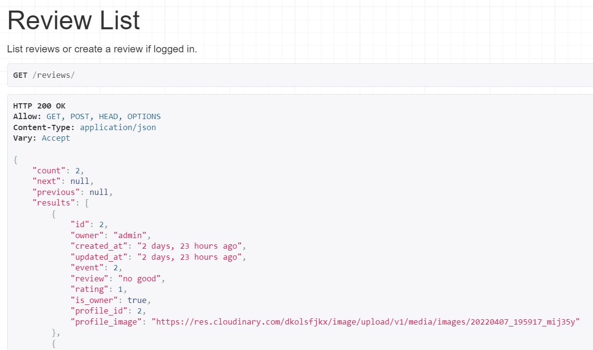

Besides the fields created in the Review model (as shown in the ERD Diagram), through the serializer, I also added the following fields to the JSON data:

* is_owner
* profile_id
* profile_image

I also set up one field filter to filter the reviews by the event they are reviewing.

If the user logs in, a form becomes visible under the reviews list to create a new review. The event they want to review can be selected from the dropdown, and a review text and rating must be entered to post the review successfully.

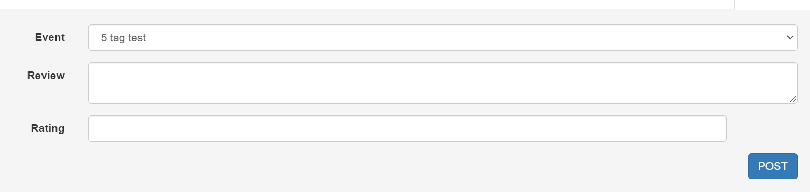

If a user tries to review same event twice, they see an error message saying that they have already reviewed the selected event, and the duplicate review is not created.

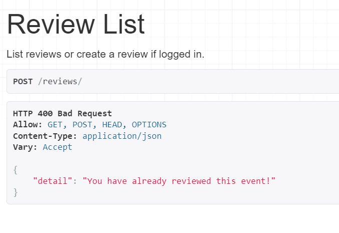

Once logged in, if the user views the details of a single review which they created additional Update and Delete functionality becomes available. Below the comment data, a pre-populated form is available to edit the comment. At the top of the screen, a delete button is available to delete the comment from the API.

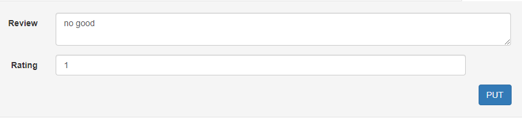

## Contact Data

Within the Contact List section, a user can view a list of all contacts posted in the API. 

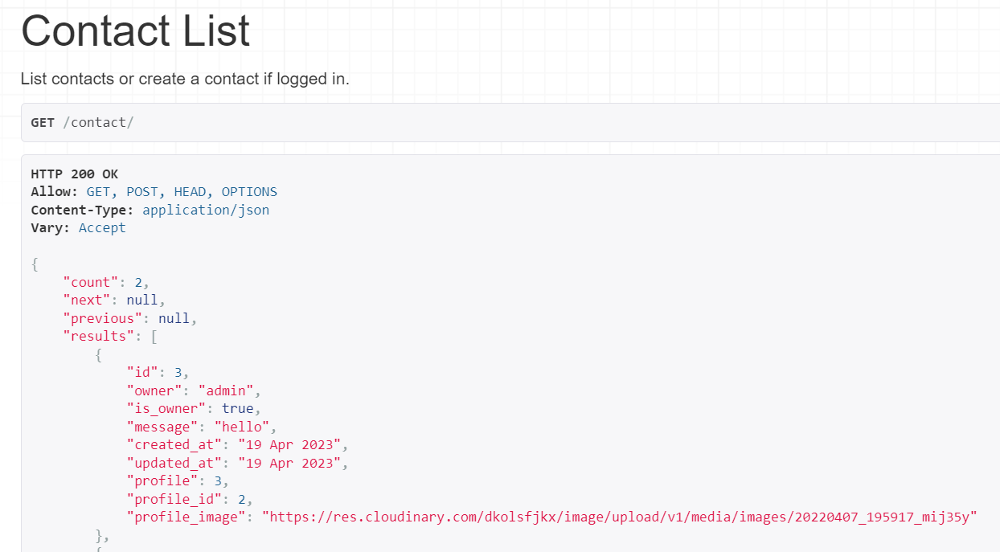

Besides the fields created in the Contact model (as shown in the ERD Diagram), through the serializer, I also added the following fields to the JSON data:

* is_owner
* profile_id
* profile_image

I also set up one field filter to filter the messages by the profile they are sent to.

If the user logs in, a form becomes visible under the contact list to create a new contact. The profile they want to contact can be selected from the dropdown, and a message text must be entered to post the contact successfully.

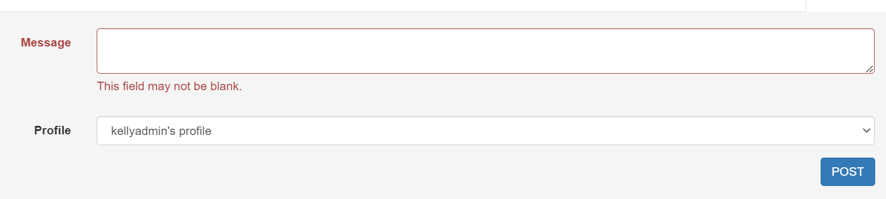

Once logged in, if the user views the details of a single contact which they created additional Update and Delete functionality becomes available. Below the contact data, a pre-populated form is available to edit the contact. At the top of the screen, a delete button is available to delete the contact from the API.

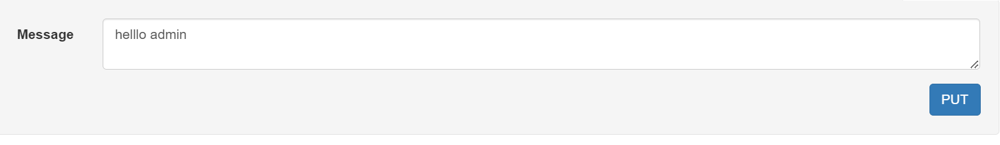

# Agile Workflow

## Github Project Board

I used the Kanban project board in Github to build this API using Agile principles from the start. The user stories created are for a developer or superuser to follow and test throughout the build process. I created a Milestone for each app (model) that I created, which I used to mark out the individual sprints of the project, and within each milestone are the related developer user stories. 

Each user story has a level of prioritisation using the MoSCoW method and a number of User Story points to indicate the level of difficulty for that feature. 

When each feature was built and committed in GitPod, the commit message has been linked to the relevant User Story. 

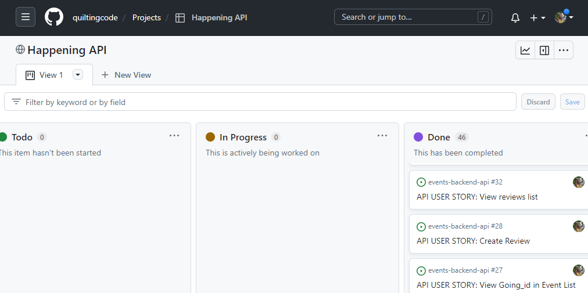
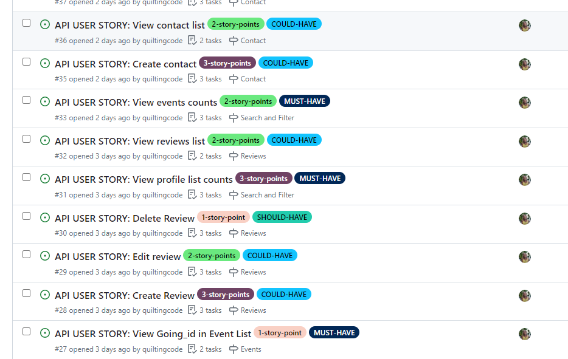

# Testing

Please click [**_here_**](TESTING.md) to read more information about testing Happening API

# Deployment

The project was deployed to [Heroku](https://www.heroku.com). To deploy, please follow the process below:

1. To begin with we need to create a GitHub repository from the [Code Institute template](https://github.com/Code-Institute-Org/gitpod-full-template) by following the link and then click 'Use this template'.

2. Fill in the details for the new repository and then click 'Create Repository From Template'.

3. When the repository has been created, click on the 'Gitpod' button to open it in the GitPod Editor.

4. Now it's time to install Django and the supporting libraries that are needed, using the following commands:

* ```pip3 install 'django<4' gunicorn```
* ```pip3 install 'dj_database_url psycopg2```
* ```pip3 install 'dj3-cloudinary-storage```

5. When Django and the libraries are installed we need to create a requirements file.

* ```pip3 freeze --local > requirements.txt``` - This will create and add required libraries to requirements.txt


6. Now it's time to create the project.

* ```django-admin startproject YOUR_PROJECT_NAME .``` - This will create the new project.

7. When the project is created we can now create the applications. My project consists of the following apps; Profiles, Comments, Contact, Events, Followers, Going, Interested and Reviews.

* ```python3 manage.py startapp APP_NAME``` - This will create an application

8. We now need to add the applications to settings.py in the INSTALLED_APPS list.

8. Now it is time to do our first migration and run the server to test that everything works as expected. This is done by writing the commands below.

* ```python3 manage.py makemigrations``` - This will prepare the migrations
* ```python3 manage.py migrate``` - This will migrate the changes
* ```python3 manage.py runserver``` - This runs the server. To test it, click the open browser button that will be visible after the command is run.

9. Now it is time to create our application on Heroku, attach a database, prepare our environment and settings.py file and setup the Cloudinary storage for our static and media files.

* Once signed into your [Heroku](https://www.heroku.com/) account, click on the button labeled 'New' to create a new app. 

10. Choose a unique app name, choose your region and click 'Create app".


11. Next we need to connect an external PostgreSQL database to the app from [ElephantSQL](https://customer.elephantsql.com/login).  Once logged into your ElephantSQL dashboard, you click 'Create New Instance' to create a new database. Give the database a: 
* Name
* Tiny Turtle Free Plan
* Selected data center near you

and click 'Create Instance'. Return to your ElephantSQL Dashboard, and click into your new database instance. Copy the Database URL and head back to Heroku.

12. Back in your Heroku app settings, click on the 'Reveal Config Vars' button. Create a config variable called DATABASE_URL and paste in the URL you copied from ElephantSQL. This connects the database into the app. 

13. Go back to GitPod and create a new env.py in the top level directory. Then add these rows.

* ```import os``` - This imports the os library
* ```os.environ["DATABASE_URL"]``` - This sets the environment variables.
* ```os.environ["SECRET_KEY"]``` - Here you can choose whatever secret key you want.

14. Back in the Heroku Config Vars settings, create another variable called SECRET_KEY and copy in the same secret key as you added into the env.py file. Don't forget to add this env.py file into the .gitignore file so that it isn't commited to GitHub for other users to find. 

15. Now we have to connect to our environment and settings.py file. In the settings.py, add the following code:

```import os```

```import dj_database_url```

```if os.path.isfile("env.py"):```

```import env```

16. In the settings file, remove the insecure secret key and replace it with:
```SECRET_KEY = os.environ.get('SECRET_KEY')```

17. Now we need to comment out the old database settings in the settings.py file (this is because we are going to use the postgres database instead of the sqlite3 database).

Instead, we add the link to the DATABASE_URL that we added to the environment file earlier.

18. Save all your fields and migrate the changes again.

```python3 manage.py migrate```

19. Now we can set up [Cloudinary](https://cloudinary.com/users/login?RelayState=%2Fconsole%2Fmedia_library%2Ffolders%2Fhome%3Fconsole_customer_external_id%3Dc-95a4cb26371c4a6bc47e19b0f130a1#gsc.tab=0) (where we will store our static files). First you need to create a Cloudinary account and from the Cloudinary dashboard copy the API Environment Variable.

20. Go back to the env.py file in Gitpod and add the Cloudinary url (it's very important that the url is correct):

```os.environ["CLOUDINARY_URL"] = "cloudinary://************************"```

21. Let's head back to Heroku and add the Cloudinary url in Config Vars. We also need to add a disable collectstatic variable to get our first deployment to Heroku to work.

22. Back in the settings.py file, we now need to add our Cloudinary Libraries we installed earlier to the INSTALLED_APPS list. Here it is important to get the order correct.

* cloudinary_storage
* django.contrib.staticfiles
* cloudinary

23. For Django to be able to understand how to use and where to store static files we need to add some extra rows to the settings.py file.


24. To be able to get the application to work through Heroku we also need to add our Heroku app and localhost to the ALLOWED_HOSTS list:

```ALLOWED_HOSTS = ['happening-api-kelz.herokuapp.com', 'localhost']```

25. Now we just need to create the basic file directory in Gitpod.

* Create a file called **Procfile* and add the line ```web: gunicorn PROJ_NAME.wsgi?``` to it.

26. Now you can save all the files and prepare for the first commit and push to Github by writing the lines below.

* ```git add .```
* ```git commit -m "Deployment Commit```
* ```git push```

27. Now it's time for deployment. Scroll to the top of the settings page in Heroku and click the 'Deploy' tab. For deployment method, select 'Github'. Search for the repository name you want to deploy and then click connect.

28. Scroll down to the manual deployment section and click 'Deploy Branch'. Hopefully the deployment is successful!


The live link to the Happening API on Heroku can be found [here](https://happening-api-kelz.herokuapp.com/). And the Github repository can be found [here](https://github.com/quiltingcode/events-backend-api).

[Back to top](<#table-of-content>)

## How To Fork The Repository On GitHub

It is possible to make an independent copy of a GitHub Repository by forking the GitHub account. The copy can then be viewed and it is also possible to make changes in the copy without affecting the original repository. To fork the repository, follow these steps:

1. After logging in to GitHub, locate the repository. On the top right side of the page there is a 'Fork' button. Click on the button to create a copy of the original repository.


[Back to top](<#table-of-content>)

## Cloning And Setting Up This Project

To clone and set up this project you need to follow the steps below.

1. When you are in the repository, find the code tab and click it.
2. To the left of the green GitPod button, press the 'code' menu. There you will find a link to the repository. Click on the clipboard icon to copy the URL.
3. Use an IDE and open Git Bash. Change directory to the location where you want the cloned directory to be made.
4. Type 'git clone', and then paste the URL that you copied from GitHub. Press enter and a local clone will be created.

5. To be able to get the project to work you need to install the requirements. This can be done by using the command below:

* ```pip3 install -r requirements.txt``` - This command downloads and installs all required dependencies that is stated in the requirements file.

6. The next step is to set up the environment file so that the project knows what variables that needs to be used for it to work. Environment variables are usually hidden due to sensitive information. It's very important that you don't push the env.py file to Github (this can be secured by adding env.py to the .gitignore-file). The variables that are declared in the env.py file needs to be added to the Heroku config vars. Don't forget to do necessary migrations before trying to run the server.

* ```python3 manage.py migrate``` - This will do the necessary migrations.
* ```python3 manage.py runserver``` - If everything i setup correctly the project is now live locally.

# Credits

* The default profile pic image was taken from [VectorStock](https://www.vectorstock.com/royalty-free-vectors/default-profile-vectors)
* I watched a tutorial video on [YouTube](https://www.youtube.com/watch?v=D3iPIoTL9sk
https://codingpr.com/star-rating-blog/
) to learn about implementing a rating system into my reviews app
* I learned about [Django Taggit](https://django-taggit.readthedocs.io/en/latest/api.html) before implementing this library into my events app
* I also read this [dev.to](https://dev.to/tikam02/how-to-implement-django-search-field-and-tags-keywords-286a) blog on how to use tag fields effectively in a keyword search bar