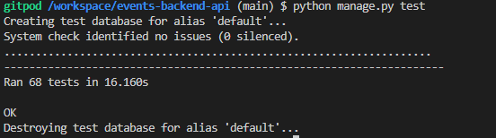
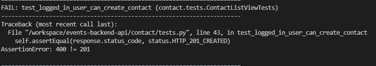

# **Happening API**

# Testing

## Table of Contents

* [**Testing**](<#testing>)
    * [Code Validation](<#code-validation>)
    * [Automatic Testing](<#automatic-testing>)
    * [Manual Testing](<#manual-testing>)
    * [Known Bugs](<#known-bugs>)

## Code Validation 

### PEP8

The Happening API has been passed through the internal PEP8 validation tests which I installed into GitPod. The method I used to do this was as per the Slack Article written by kevin_ci on the 28th September 2022 in #announcements, since the PEP8online website no longer works:

1. Run the command 'pip3 install pycodestyle'
2. Press Ctrl+Shift+P
3. Type 'linter' into the search field
4. Select 'Python: Select Linter
5. Select 'pycodestyle' from the list
6. Select the 3 lines menu in the top left hand corner. Select 'View' and then 'Problems'. 
6. PEP8 errors are now displayed in a list as well as being underlined in red in the central editor window.

### Events_api files

* permissions.py - No problems or warnings found
* serializers.py - No problems or warnings found
* views.py - No problems or warnings found
* models.py - No problems or warnings found
* urls.py - No problems or warnings found

### Comments App py files

* models.py - No problems or warnings found
* serializers.py - No problems or warnings found
* tests.py - No problems or warnings found
* urls.py - No problems or warnings found
* views.py - No problems or warnings found

### Contact App py files

* models.py - No problems or warnings found
* serializers.py - No problems or warnings found
* tests.py - No problems or warnings found
* urls.py - No problems or warnings found
* views.py - No problems or warnings found

### Events App py files

* models.py - No problems or warnings found
* serializers.py - No problems or warnings found
* tests.py - No problems or warnings found
* urls.py - No problems or warnings found
* views.py - No problems or warnings found

### Followers App py files

* models.py - No problems or warnings found
* serializers.py - No problems or warnings found
* tests.py - No problems or warnings found
* urls.py - No problems or warnings found
* views.py - No problems or warnings found

### Going App py files

* models.py - No problems or warnings found
* serializers.py - No problems or warnings found
* tests.py - No problems or warnings found
* urls.py - No problems or warnings found
* views.py - No problems or warnings found

### Interested App py files

* models.py - No problems or warnings found
* serializers.py - No problems or warnings found
* tests.py - No problems or warnings found
* urls.py - No problems or warnings found
* views.py - No problems or warnings found

### Profiles App py files

* models.py - No problems or warnings found
* serializers.py - No problems or warnings found
* tests.py - No problems or warnings found
* urls.py - No problems or warnings found
* views.py - No problems or warnings found

### Reviews App py files

* models.py - No problems or warnings found
* serializers.py - No problems or warnings found
* tests.py - No problems or warnings found
* urls.py - No problems or warnings found
* views.py - No problems or warnings found

## Automatic Testing

The following automatic tests have been written into the Happening API, in order to cover all the user story scenarios. These are the tests that were created: 

| Status | **Profiles**
|:-------:|:--------|
| &check; | Profile automatically created on user creation
| &check; | Can list profiles
| &check; | Can retrieve profile using valid ID
| &check; | Can't retrieve profile using invalid ID
| &check; | Can update own profile
| &check; | Can't update someone else's profile
| &check; | Can delete own profile
| &check; | Can't delete someone else's profile

| Status | **Events**
|:-------:|:--------|
| &check; | Can list events
| &check; | Logged out user can't create event
| &check; | Logged in user can create event
| &check; | Can retrieve event using valid ID
| &check; | Can't retrieve event using invalid ID
| &check; | Can update own event
| &check; | Can't update someone else's event
| &check; | Can delete own event
| &check; | Can't delete someone else's event

| Status | **Interested**
|:-------:|:--------|
| &check; | Can list interested
| &check; | Logged out user can't create interested
| &check; | Logged in user can create interested
| &check; | Can retrieve interested using valid ID
| &check; | Can't retrieve interested using invalid ID
| &check; | Can delete own interested
| &check; | Can't delete someone else's interested
| &check; | Can't post interested to the same event twice

| Status | **Going**
|:-------:|:--------|
| &check; | Can list going
| &check; | Logged out user can't create going
| &check; | Logged in user can create going
| &check; | Can retrieve going using valid ID
| &check; | Can't retrieve going using invalid ID
| &check; | Can delete own going
| &check; | Can't delete someone else's going
| &check; | Can't post going to the same event twice

| Status | **Comments**
|:-------:|:--------|
| &check; | Can list comments
| &check; | Logged out user can't create comment
| &check; | Logged in user can create comment
| &check; | Can retrieve comment using valid ID
| &check; | Can't retrieve comment using invalid ID
| &check; | Can update own comment
| &check; | Can't update someone else's comment
| &check; | Can delete own comment
| &check; | Can't delete someone else's comment

| Status | **Reviews**
|:-------:|:--------|
| &check; | Can list reviews
| &check; | Logged out user can't create review
| &check; | Logged in user can create review
| &check; | Can retrieve review using valid ID
| &check; | Can't retrieve review using invalid ID
| &check; | Can update own review
| &check; | Can't update someone else's review
| &check; | Can delete own review
| &check; | Can't delete someone else's review
| &check; | Can't review the same event twice

| Status | **Followers**
|:-------:|:--------|
| &check; | Can list followers
| &check; | Logged out user can't follow
| &check; | Logged in user can follow
| &check; | Can retrieve followers using valid ID
| &check; | Can't retrieve followers using invalid ID
| &check; | Can delete follow from my own profile
| &check; | Can't delete someone else's follow
| &check; | Can't follow the same profile twice

| Status | **Contact**
|:-------:|:--------|
| &check; | Can list contacts
| &check; | Logged out user can't create contact
| &cross; | Logged in user can create contact
| &check; | Can retrieve contact using valid ID
| &check; | Can't retrieve contact using invalid ID
| &check; | Can update own contact
| &check; | Can't update someone else's contact
| &check; | Can delete own contact
| &check; | Can't delete someone else's contact

## Manual Testing

As well as the automatic tests which can be found in each app's testing.py file, I carried out the following additional manual tests:

| Status | **Profiles**
|:-------:|:--------|
| &check; | Profile List can be ordered by events_count in ascending order
| &check; | Profile List can be ordered by events_count in descending order
| &check; | Profile List can be ordered by followers_count in ascending order
| &check; | Profile List can be ordered by followers_count in descending order
| &check; | Profile List can be ordered by following_count in ascending order
| &check; | Profile List can be ordered by following_count in descending order
| &check; | Profile List can be ordered by going_count in ascending order
| &check; | Profile List can be ordered by going_count in descending order
| &check; | Profile List can be ordered by owner__following__created_at in ascending order
| &check; | Profile List can be ordered by owner__following__created_at in descending order
| &check; | Profile List can be ordered by owner__followed__created_at in ascending order
| &check; | Profile List can be ordered by owner__followed__created_at in descending order
| &check; | Profile List can be filtered by owner__following__followed__profile
| &check; | Profile List can be filtered by owner__followed__owner__profile

| Status | **Events**
|:-------:|:--------|
| &check; | Event List can be ordered by comments_count in ascending order
| &check; | Event List can be ordered by comments_count in descending order
| &check; | Event List can be ordered by interested_count in ascending order
| &check; | Event List can be ordered by interested_count in descending order
| &check; | Event List can be ordered by going_count in ascending order
| &check; | Event List can be ordered by going_count in descending order
| &check; | Event List can be ordered by review_count in ascending order
| &check; | Event List can be ordered by review_count in descending order
| &check; | Event List can be ordered by average_rating in ascending order
| &check; | Event List can be ordered by average_rating in descending order
| &check; | Event List can be ordered by interested__created_at in ascending order
| &check; | Event List can be ordered by interested__created_at in descending order
| &check; | Event List can be ordered by going__created_at in ascending order
| &check; | Event List can be ordered by going__created_at in descending order
| &check; | Event List can be ordered by event_date in ascending order
| &check; | Event List can be ordered by event_date in descending order
| &check; | Event List can be searched on by owner 'admin'
| &check; | Event List can be searched on by title 'event'
| &check; | Event List can be searched on by tag 'sport'
| &check; | Event List can be searched on by event_date '18'
| &check; | Event List can be searched on by event_date '04' for all April events
| &check; | Event List can be filtered by owner__followed__owner__profile
| &check; | Event List can be filtered by interested__owner__profile
| &check; | Event List can be filtered by going__owner__profile
| &check; | Event List can be filtered by owner__profile
| &check; | Event List can be filtered by category

| Status | **Comments**
|:-------:|:--------|
| &check; | Comment List can be filtered by event

| Status | **Reviews**
|:-------:|:--------|
| &check; | Review List can be filtered by event

| Status | **Contact**
|:-------:|:--------|
| &check; | Logged in user can create comment

## Known Bugs

### Resolved

1. In my first project inception mentor meeting, I asked about what kind of field a 'Tags' model field would be, and whether it could just be a standard CharField. My mentor said that keywords should be stored in an array, so after further investigation I installed the Django Taggit Manager package to create an automatic array of words the user inputs into the events form 'tags' field. For some reason, however, despite using the blank=True attribute as per the Taggit docs, the API still requires this field to be filled in in order to sucessfully create a new event. I decided that this was not the end of the world and after a lot of research I left it as a required field. When I came to testing, my events tests were failing since I had changed over to Taggit, and so I had to amend the tests where an event is created to include a tags field as well as the title in order for the tests to pass. 

2. While testing the followers app, the test 'can_view_follower_list' kept failing and I couldn't understand why. I tried using the model field names for owner and followed but this didn't work. I tried using the related field names but this didn't work either. In the end, I realised while trying to replicate the process in the local server, the URL for Profile List was different. It was missing the last '/' so I amended this in the urls.py file and all the tests passed after this. 

3. Setting up the tests for the contact app, I can't seem to create the test correctly for 'logged_out_user_can_create_contact' and 'logged_in_user_can_create_contact'.  I don't seem to be setting up the create object response correctly, and I asked tutor support and they were unable to tell me how to do it correctly. I decided to do manual tests on this app until I could seek further advice, and on beginning the manual testing, I found that my permsisions were not set up correctly, and I could in fact create a contact whilst being logged out, hence why my automatic test was failing. I have now changed the permissions, and the automatic test for 'logged_out_user_cant_create_contact is now passing. 

Please click [**_here_**](README.md) to return to the Happening API README file.